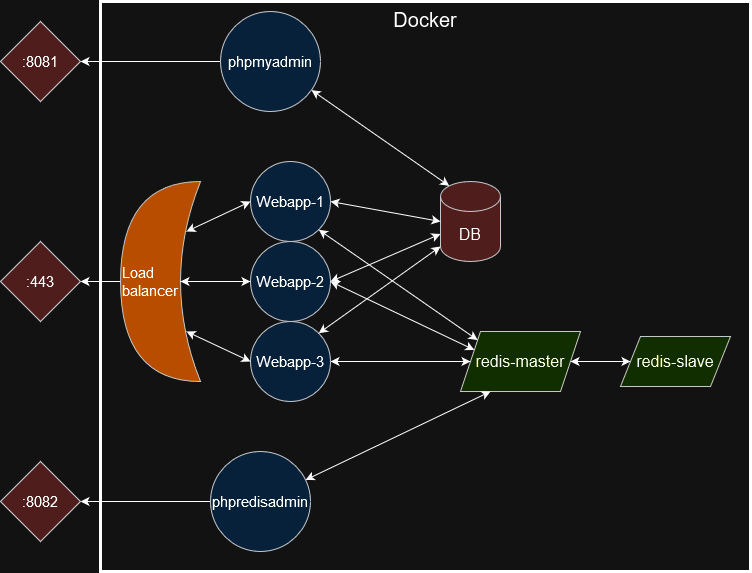

# Infraestructura como código
Este repositorio consiste en una prueba de despliege de diferentes servicios conectados entre sí basándose en el repositorio de `Despliegue-aplicaciones-multi-entorno` y en dos entornos distintos, desarrollo y producción, usando la herramienta de Terraform.<br>
Los diferentes servicios son una aplicación web, una base de datos, una caché, un load balancer y un servicio de monitorización con prometheus y grafana. El servicio de alertmanager para las alertas sólo se despliega en el entorno de producción además de las siguientes configuraciones de alta disponibilidad:
* La web tiene 3 instancias en vez de 2.
* La caché está configurada con alta disponibilidad con 2 esclavos.



## Despliegue de entornos
Primero se deberían realizar las siguientes configuraciones.<br>
Añadir los workspaces de dev y pro con los comandos:
- `terraform workspace new dev`
- `terraform workspace new pro`

Un archivo `var.tfvars` para las variables de entorno con el siguiente contenido:
``` 
# WebApp env variabes
db_user = "user"
db_pass = "pass"
db_root_pass = "pass"

# Grafana
grafana_pass = "pass"
```

### Lanzar dev
Para lanzar el entorno de dev primero tendremos que seleccionar el workspace de dev, seguido de un init y un apply:<br>
(Si antes has lanzado otro entorno es mejor que hagas un `terraform destroy -var-file="var.tfvars"`)
```
terraform workspace select dev
terraform init # Si no lo has hecho antes
terraform apply -var-file="var.tfvars"
```
Ahora se puede acceder a la web mediante el load balancer (la web te dirá en que contenedor estás):
* Para acceder a la aplicación web hay que entrar en: https://localhost
> Hay que aceptar el certificado ya que está autofirmado.
* Para acceder al servicio para administrar la base de datos se debe entrar en la siguiente web en localhost: http://localhost:8081
> Con usuario `user` y contraseña `pass`.
* Administrar la caché: http://localhost:8082
> La caché no tiene usuario ni contraseña.
* Prometheus: http://localhost:8083
* Grafana: http://localhost:8084
> Con usuario `admin` y contraseña `pass`.

### Lanzar pro
Para lanzar el entorno de dev primero tendremos que seleccionar el workspace de pro, seguido de un init y un apply:<br>
(Si antes has lanzado otro entorno es mejor que hagas un `terraform destroy -var-file="var.tfvars"`)
```
terraform workspace select pro
terraform init # Si no lo has hecho antes
terraform apply -var-file="var.tfvars"
```
Ahora se puede acceder a la web mediante el load balancer (la web te dirá en que contenedor estás):
* Para acceder a la aplicación web hay que entrar en: https://localhost
> Hay que aceptar el certificado ya que está autofirmado.
* Para acceder al servicio para administrar la base de datos se debe entrar en la siguiente web en localhost: http://localhost:8081
> Con usuario `user` y contraseña `pass`.
* Administrar la caché: http://localhost:8082
> La caché no tiene usuario ni contraseña.
* Prometheus: http://localhost:8083
* Grafana: http://localhost:8084
> Con usuario `admin` y contraseña `pass`.
* Alermanager: http://localhost:8085

## Test
Se ha incluido un archivo de test `test.sh` que comprueba sobretodo que el apartado de monitorización funciona, apagando y encendiendo los diferentes servicios. Puedes seguir sus acciones mediante grafana `http://localhost:8084`.<br>
El script está pensado de tal forma que cuando para un servicio espera a que se pulse una tecla para continuar, de esta forma da tiempo a ver los resultados en grafana y la o las alertas en alertmanager.